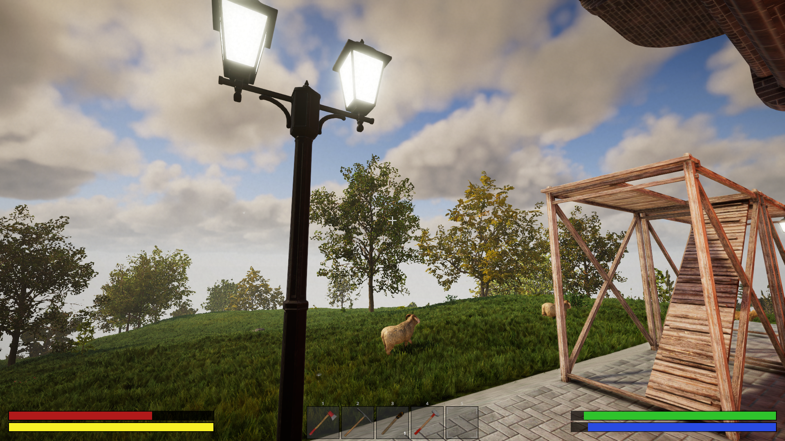

# Advanced Status

A plugin for Rising World that will change status bars and icons for player.
The goal is to make player GUI more comfortable and informative.

**What plugin adds:**
- Bars for health, stamina, hunger and thirst
- Custom icons for broken bones, bleeding and healed bones

**What is planned:**
- Bars for oxygen and armor
- Icons for temperature and other effect

**Known Bugs:**
- Stamina bar is not updating correctly